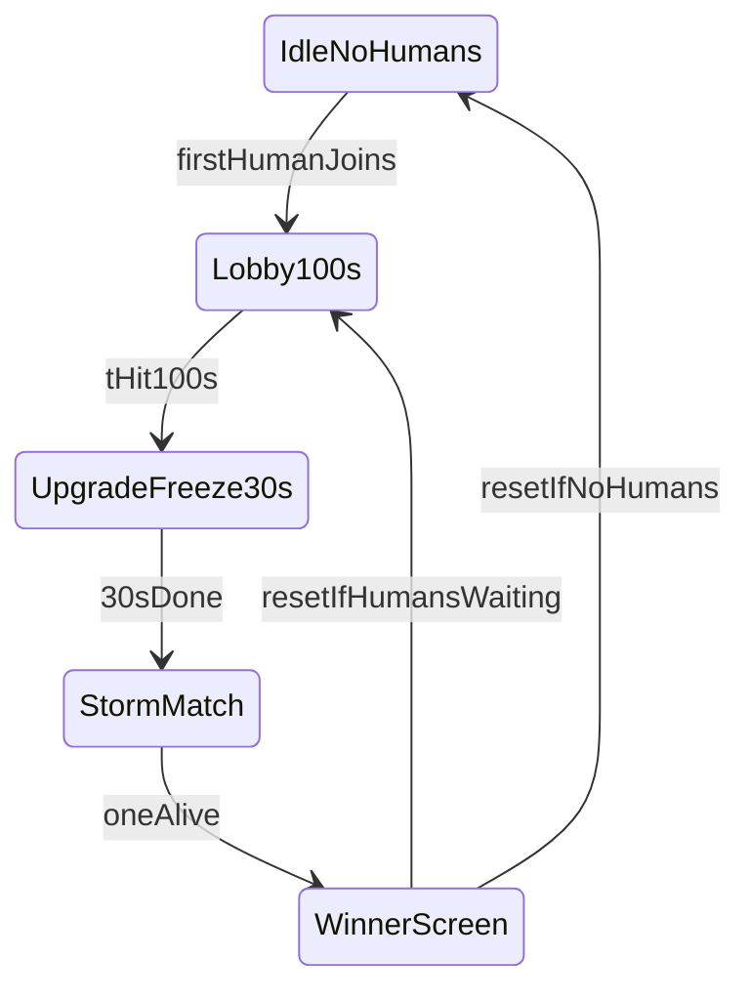

# Dig Royale (solo BR) in phases

Keep every existing Dig Wars 2TDM file. The new mode is a **second server**, not a rewrite of the first.

**Fun rule for every phase:** if a choice is “more realistic Fortnite” vs “more fun in a 2D tank-and-rock game,” pick fun. Short waits, readable danger, loud rewards, no dead time.

## What stays vs what is new

- **Keep, unlisted:** current `dig_wars` worker (id `dw` today). Set `unlisted: true`, `featured: false`. Name stays Dig Wars 2TDM. Tutorial stays as-is.
- **New, featured main:** `dig_royale` on the share-client / main port (today that is the `dw` slot on 3100 / Render’s single process). Dig Wars 2TDM moves to its own worker port (same pattern as tutorial on 3101).
- **Reuse:** rock Voronoi + mining + gems + satchels ([server/game/terrain/terrainGrid.js](server/game/terrain/terrainGrid.js), [gems.js](server/game/terrain/gems.js)), vault deposit loop, outpost “break the structure to take it,” bot bodies, victory banner plumbing.
- **Do not put on the BR map (v1):** shops, core chambers, team bases, war-effort score bar, 2TDM canyons. Those stay in Dig Wars only.

Lobby timing (your pick): **100 seconds from the first human**, then the match starts even if they are still the only human. **Bots never start a match.** Bots **do** fill and play once a human has started the lobby countdown.

Player cap: **not 100 tanks.** That would recreate the 1000-ping problem. v1 target is about **20 total combatants** (humans + bot fill). The 0–100 number is the lobby clock, not the roster.

## Phase 0 — Server split (no gameplay yet)

Wire the new mode beside Dig Wars so nothing 2TDM-shaped is deleted.

- Add [server/game/gamemodes/config/dig_royale.js](server/game/gamemodes/config/dig_royale.js): `mode: "ffa"`, `teams: 1`, `dig_wars: false`, `dig_royale: true`, no food, own `room_setup` + terrain size.
- Add a thin script [server/game/gamemodes/scripts/dig_royale.js](server/game/gamemodes/scripts/dig_royale.js) and register it in [server/game/gamemodeManager.js](server/game/gamemodeManager.js) behind `Config.dig_royale` only.
- [server/config.js](server/config.js) `servers[]`:
  - Featured: `id: 'br'`, `gamemode: ['dig_royale']`, `unlisted: false`, bot_cap used as **fill cap** (e.g. 20 minus humans).
  - Unlisted Dig Wars: current `dig_wars` entry, `unlisted: true`, keep `bot_cap` / teams.
- [server/game.js](server/game.js) `getName`: `dig_royale` → a short public name like `Dig Royale`.
- Gate every 2TDM-only tick (war bar, team vaults, team outpost capture, core chambers) with `Config.dig_wars`, never `Config.dig_royale`.

## Phase 1 — Circular rock map + your POI layout

The whole playable world is **rock**, clipped to a **circle** (your sketch). No blue/red base tiles.

- New room [server/game/roomSetup/rooms/room_dig_royale.js](server/game/roomSetup/rooms/room_dig_royale.js): square tile grid, all `normal` (no `base1`/`base2`).
- New layout pass (prefer a dedicated [server/game/terrain/royaleLayout.js](server/game/terrain/royaleLayout.js) called from map gen / `TerrainGrid` when `Config.dig_royale`):
  - Fill the inscribed circle with the existing Voronoi rocks.
  - Carve **one-cell spawn pits** packed far apart (farthest-point sampling). These are the drop holes.
  - Carve POIs from the sketch, as fractions of the circle (no shops):
    - Vaults (circles): center, upper-left, lower-right.
    - Outposts (squares): N red, NE green, E purple, S yellow, SW blue, W orange.
  - Center also works as the **lobby plaza** (larger carve) until scatter.
- Storm and camera treat the circle, not the square room corners, as “the map.”

## Phase 2 — Match flow (the Fortnite skeleton)

All of this lives in the new royale script + a small client HUD. This is the fun core; ship it before pretty storm.

**Idle:** no bots, no storm, no damage. Server stays cheap.

**Lobby (100s):** first human starts the clock (count 0 → 100). Everyone (later: bots wait until scatter) is invulnerable, cannot deal damage, can drive around the plaza. Big readable countdown. If all humans leave, cancel and return to idle (do not run a bot-only match).

**Scatter:** freeze, then drop each combatant (humans + bot fill) into a unique spawn pit. Maximize separation. One body per hole.

**Loadout (30s):** cannot move, cannot shoot, cannot mine. Must still **open upgrades**. Persistent toast: *Upgrade your build and tanks.* Bots spend this window picking class + stats (reuse existing bot upgrade code, just do it here instead of while driving).

**Live:** last combatant alive wins. **No respawn.** Death = spectate (existing death cam). When one remains, winner banner (reuse [public/client/app.js](public/client/app.js) war victory overlay, retitled), then reset the arena: new rock seed optional, back to lobby/idle.

**Bots at fill:** spawn only at scatter, same freeze/loadout/rules as players.

## Phase 3 — Storm (steady close, no pauses)

Not Fortnite phases. From the moment **live** starts, a circle shrinks at a **constant rate** until radius ~0, then holds full cover until someone wins.

- Server [server/game/terrain/storm.js](server/game/terrain/storm.js): center = map center, `radius(t)` linear. Damage **5% of that tank’s max health every 1.5s** while outside the safe circle (`0.05 * health.max`, so a 200-HP tank takes 10). Ignore spawn invuln once live.
- Broadcast radius + next tick so clients interpolate.
- Client: **2D, high-contrast, not a muddy fog blob.** Think a hard indigo/violet **wall ring** on the floor layer, a faint hatch or stripe **outside** the ring, and a minimap circle. Must read at a glance: “safe / not safe.”
- Fun extras that are cheap: screen-edge tint when you are in storm, ticking damage numbers, optional rumble already in shake code (do not overdo VFX).

## Phase 4 — Vaults and outposts (solo rules)

**Public vaults (3):** not team-colored. Rainbow-shift the existing vault art (HSV cycle on the gem/rim only; keep the dark steel plate). Anyone can deposit. Not a safe house — storm still hurts if the vault is already outside the circle.

**Outposts (6):** start **neutral** (grey + a soft unowned glow, not yellow-on-blue). Breaking the structure captures it for **that player/bot** (owner id, not team). Recolor to that site’s **fixed sketch color** (red / green / purple / yellow / blue / orange). A **body ring** in that same color marks the owner.

While you own it:

- Only the owner may enter the pad (others bounce off the rim).
- Owner can use the **inner vault**.
- **10s occupancy** then a **smooth knock-out bounce** to just outside the pad.
- **10s re-entry lockout** with a **client-side countdown** on the owner (and a small pad timer so attackers can read it).
- Another player can still **break the structure** from outside to steal (then they become owner, new color ring).

Bots: they should **contest outposts sometimes**, but **kills are the main goal** so they do not all turtle on pads.

## Phase 5 — Bots that play this mode

Extend [server/miscFiles/controllers.js](server/miscFiles/controllers.js) behind `Config.dig_royale` only (do not change 2TDM bot goals):

- Respect lobby / freeze / loadout.
- After live: hunt nearby players first; take a nearby unowned/enemy outpost if nobody is in range and the storm is eating that side of the map.
- Run from storm (steer toward safe radius) harder than they hunt, or they will all die in the wall and the match is boring.
- Same occupancy / lockout rules as humans.

## Phase 6 — Juice (only after 2–5 work)

Kill feed, alive count, placement (“#3”), storm on minimap, capture shout, loadout music-less but punchy toasts. No shops. No duos/squads yet (data model can store `partySize: 1` so later modes do not rewrite ownership).

## What we will not do in v1

- Duos/squads, shops, core chambers, 100-player lobbies, Fortnite-style storm pauses, rewriting Dig Wars 2TDM.

## Primary files

- Config / list: [server/config.js](server/config.js), [server/game.js](server/game.js), [server/game/gamemodeManager.js](server/game/gamemodeManager.js)
- New mode: `server/game/gamemodes/config/dig_royale.js`, `scripts/dig_royale.js`, `roomSetup/rooms/room_dig_royale.js`
- Terrain: [mapGen.js](server/game/terrain/mapGen.js), [terrainGrid.js](server/game/terrain/terrainGrid.js), new `royaleLayout.js` + `storm.js`
- Structures: [vault.js](server/game/terrain/vault.js), [outposts.js](server/game/terrain/outposts.js) with royale branches
- Client: [public/client/app.js](public/client/app.js) (vault/outpost/storm/HUD), [socketinit.js](public/client/socketinit.js)
- Bots: [controllers.js](server/miscFiles/controllers.js), [server/game/index.js](server/game/index.js) spawn/fill
